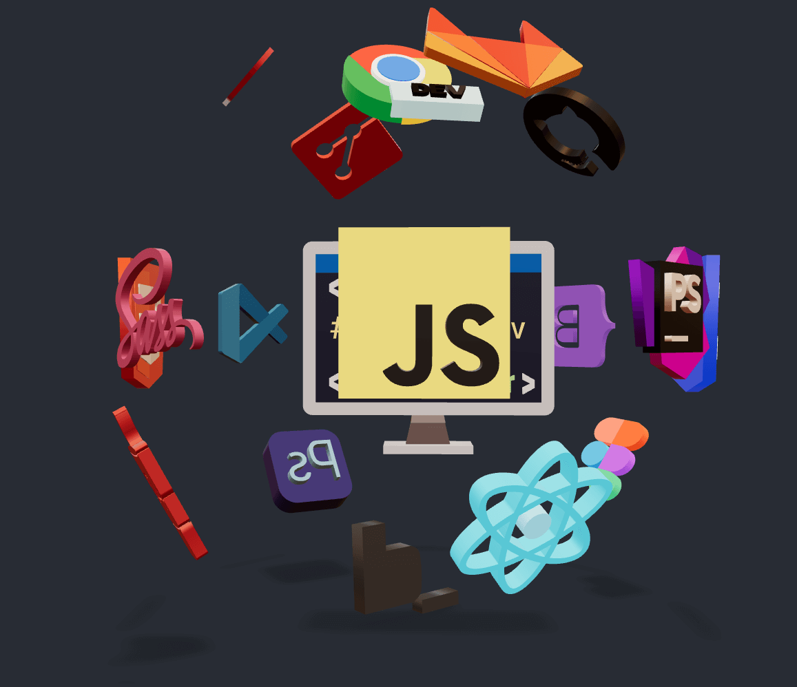

# Valerii Lozghachov portfolio page

## Task and idea

- The main idea is to create an interesting and beautiful UI with a Visual Studio Code-like interface with React.
- Using CSS variables create a color theme switcher, based on the VS code IDE colors.
- The page must be responsive to any display resolutions.
- VS code tabs play the role as a navigations bar
- Create a 3D model of skills using Blender software
- Create reusable components

## Tools & dependencies

- Blender
- Create React App
- React 18.2+
- React-dom 18.2+
- React-router-dom 6.3+
- React-ztext library
- Swiper slider
- Three JS
- Google model-viewer
- CSS modules

## Preview

[live preview](https://valerii-frontend.github.io/portfolio-react)

## Author

### LinkedIn - [v.lozghachov](https://www.linkedin.com/feed/)
